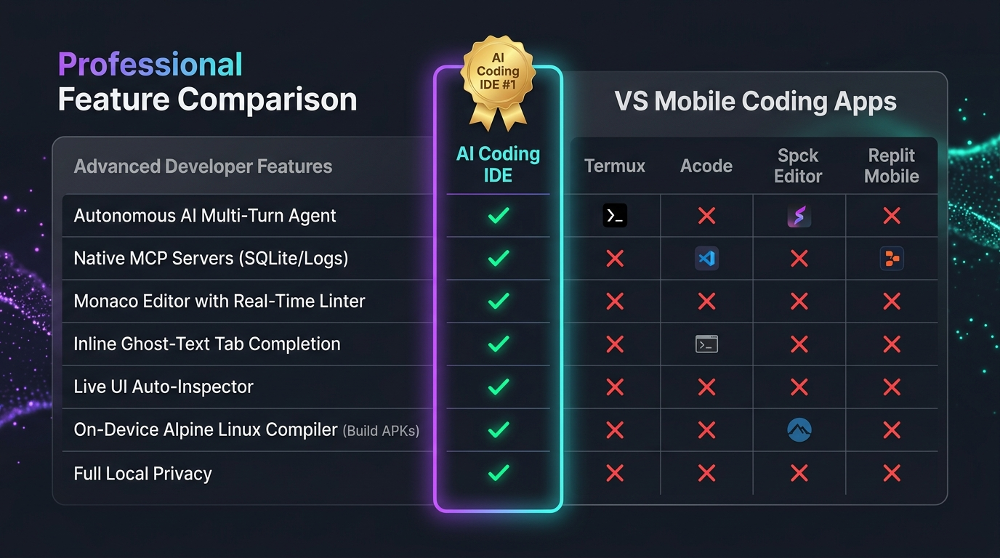

# AI Coding IDE 🚀

> **The first professional AI-powered IDE with on-device native compilation for Android.**  
> *A primeira IDE profissional com IA autônoma e compilação nativa diretamente no seu celular Android.*

---

[-3DDC84?style=for-the-badge&logo=android&logoColor=white)](#)

---

  

    
  

  <h3>🌐 Escolha seu idioma / Choose your language:</h3>
  

    <a href="#-english"><b>🇺🇸 English Version</b></a> &nbsp;|&nbsp;
    <a href="#-português"><b>🇧🇷 Versão em Português</b></a>
  

---

  

---

# 🇺🇸 English

## 📌 Overview

**AI Coding IDE** transforms any modern Android smartphone into a complete, self-contained software engineering workstation. It delivers the developer experience of top-tier desktop environments (*Cursor, VS Code, Android Studio*) directly into your pocket.

Equipped with an **Autonomous AI Agent**, an ultra-fast **On-Device Native Compiler**, a professional **Code Editor**, and a full **Linux Terminal Environment**, AI Coding IDE allows you to design, write, debug, compile, and install real Android apps anywhere—completely offline with zero PC or cloud dependencies.

---

## ✨ Key Superpowers

### 📱 1. 100% On-Device Native App Compilation
* **No PC, No Cloud, No Subscriptions:** Build, package, and sign real Android `.apk` files directly using your smartphone's processor.
* **Ultra-Fast Performance:** Compiles full Kotlin and Java Android projects in ~12 seconds.
* **1-Click APK Installation:** Built-in APK installer launches the Android package installation flow instantly from the file explorer.
* **Universal Compatibility:** Fully tested and optimized for Android 8.0 up to Android 14 / 15 and HyperOS.

### 🤖 2. Autonomous Multi-Turn AI Agent
* **Full Agentic Workflow:** The AI doesn't just predict code—it reads files, plans complex tasks, writes surgical diffs, runs terminal diagnostic commands, and verifies results in real-time.
* **Consolidated Reasoning:** Clean, modern reasoning summaries keep the chat uncluttered and focused on results.
* **Fast Intent Engine (System 1 / Jev-Pattern):** Sub-millisecond deterministic intent routing (< 0.1 ms) directly on-device, bypassing slow cloud roundtrips for instant actions.
* **Integrated Live Preview & Web Engine:** Instant browser evaluation, DOM diagnostics, and live CSS/HTML testing directly in the mobile workspace.
* **Model Agnostic:** Connect directly to **DeepSeek (V3 & Reasoner)**, **Claude 3.5 / 3.7**, **GPT-4o**, **Google Gemini**, **NVIDIA NIM**, **OpenRouter**, or run local offline models with **Ollama**.

### 💻 3. Professional Mobile Code Editor
* **Desktop-Grade Capabilities:** Full syntax highlighting for 50+ languages, smart code completion, bracket matching, and error linting.
* **Inline AI (Ctrl+K):** Prompt AI directly inside any code file to refactor, generate, or review snippets with touch gestures.
* **Shadow Workspace (Safe Sandbox):** Preview speculative AI modifications side-by-side before applying them to your workspace.

### 🐧 4. Integrated Linux Terminal & Dev Tools
* Built-in terminal supporting Git, shell utilities, and script execution.
* Coordinated with the AI agent to automate builds, tests, and environment setup.

### 🔒 5. Zero-Cloud Privacy
* Your source code and project data stay strictly on your device storage.
* Work in airplanes, remote locations, or offline environments with total security.

---

## 📊 Comparison

| Feature | Mobile Editors (Acode, DroidScript) | Cloud IDEs (Replit, GitHub Codespaces) | AI Coding IDE 🚀 |
| :--- | :---: | :---: | :---: |
| **On-Device Native Compilation** | ❌ (No / Limited) | ❌ (Requires Cloud VM) | ✅ **100% Native on Phone (~12s)** |
| **Autonomous Multi-Turn AI** | ❌ None | ⚠️ Basic suggestions | ✅ **Full Agent with 17+ Tools** |
| **1-Click APK Install from UI** | ❌ No | ❌ No | ✅ **Direct Device Installer** |
| **Offline Privacy & Security** | ⚠️ Partial | ❌ Cloud Required | ✅ **100% Local Storage** |
| **Integrated Terminal & Git** | ⚠️ Complex setup | ✅ Cloud | ✅ **Ready-to-use Out of the Box** |

---

## 📥 Download & Installation

👉 **[Download Official APK (v1.1.2-beta)](https://github.com/saboracaiteria/AI-Coding-IDE/releases/download/v1.1.2-beta/AI-Coding-IDE-v1.1.2-beta-arm64.apk)** *(Direct .apk download ~118 MB)*  
🌐 **[Visit Official Landing Page](https://saboracaiteria.github.io/AI-Coding-IDE/)**  
📦 **[GitHub Releases & Version History](https://github.com/saboracaiteria/AI-Coding-IDE/releases/latest)**

### System Requirements:
* **Architecture:** ARM64-v8a (Modern 64-bit Android devices)
* **Operating System:** Android 8.0 or higher (Fully verified on Android 14 / HyperOS)
* **Storage:** ~250 MB free space for IDE and local build tools

### Quick Install Guide:
1. Download the `.apk` file above.
2. Tap the downloaded file in your notification bar or file manager.
3. If prompted, enable *"Install unknown apps"* for your browser.
4. Open **AI Coding IDE** and start building apps instantly!

---

 

# 🇧🇷 Português

## 📌 Visão Geral

O **AI Coding IDE** transforma qualquer smartphone Android moderno em uma estação de engenharia de software autônoma e completa. Ele traz a experiência das principais IDEs desktop do mercado (*Cursor, VS Code, Android Studio*) direto para o seu bolso.

Unindo um **Agente de IA Autônomo**, um motor de **Compilação Nativa On-Device**, um **Editor de Código Profissional** e um **Terminal Linux Integrado**, você pode criar, programar, depurar, compilar e instalar aplicativos Android reais em qualquer lugar—totalmente offline, sem precisar de PC ou servidores em nuvem.

---

## ✨ Principais Diferenciais

### 📱 1. Compilação Nativa de APKs 100% On-Device
* **Sem Computador e Sem Nuvem:** Gere e assine arquivos `.apk` reais utilizando diretamente o processador do seu smartphone.
* **Velocidade Extrema:** Compila projetos Kotlin e Java completos em apenas ~12 segundos.
* **Instalação em 1 Toque:** Instalador nativo integrado que permite testar o APK gerado no próprio aparelho em segundos.
* **Compatibilidade Ampla:** Testado e aprovado do Android 8.0 até o Android 14 / 15 e HyperOS.

### 🤖 2. Agente de IA Autônomo
* **Fluxo Agêntico Completo:** A IA não apenas responde texto—ela inspeciona pastas, lê arquivos, aplica correções cirúrgicas de código, executa comandos no terminal e testa a aplicação.
* **Chat Limpo e Moderno:** Raciocínio condensado em cards elegantes e histórico de ferramentas compacto e organizado.
* **Motor de Roteamento Rápido (Sistema 1 / Jev-Pattern):** Decisões locais e instantâneas (< 0,1 ms) no próprio aparelho, eliminando latência de nuvem para comandos frequentes.
* **Navegador Live Preview Integrado:** Avaliação instantânea de JavaScript, inspeção de DOM e testes de CSS/HTML em tempo real na workspace.
* **Agnóstico de Modelos:** Conecte-se facilmente a **DeepSeek (V3 e Reasoner)**, **Claude 3.5 / 3.7**, **GPT-4o**, **Google Gemini**, **NVIDIA NIM**, **OpenRouter** ou rode modelos locais via **Ollama**.

### 💻 3. Editor de Código Profissional
* **Recursos Desktop:** Destaque de sintaxe para mais de 50 linguagens, autocompletar inteligente, detecção de erros e formatação.
* **Comando Rápido (Ctrl+K):** Solicite edições de código direto no arquivo com suporte a gestos de deslizar para aceitar ou recusar alterações.
* **Shadow Workspace:** Analise visualmente as alterações sugeridas pela IA lado a lado antes de aplicar ao seu projeto.

### 🐧 4. Terminal Linux Integrado
* Ambiente de terminal completo com suporte a Git, scripts shell e diagnósticos em tempo real.
* Totalmente sincronizado com o fluxo da IA para tarefas automáticas.

### 🔒 5. Privacidade Total (Zero-Cloud)
* Seus arquivos e projetos ficam guardados unicamente na memória interna do seu smartphone.
* Trabalhe com total sigilo e segurança mesmo sem conexão com a internet.

---

## 📥 Download e Instalação

👉 **[Baixar APK Oficial (v1.1.2-beta)](https://github.com/saboracaiteria/AI-Coding-IDE/releases/download/v1.1.2-beta/AI-Coding-IDE-v1.1.2-beta-arm64.apk)** *(Download direto .apk ~118 MB)*  
🌐 **[Acessar Site Oficial](https://saboracaiteria.github.io/AI-Coding-IDE/)**  
📦 **[Ver Histórico de Versões no GitHub](https://github.com/saboracaiteria/AI-Coding-IDE/releases/latest)**

### Requisitos:
* **Arquitetura:** ARM64-v8a (smartphones Android 64 bits)
* **Sistema:** Android 8.0 ou superior (Testado no Android 14 e HyperOS)
* **Armazenamento:** ~250 MB livres

---

  
© 2026 AI Coding IDE • Todos os direitos reservados.

