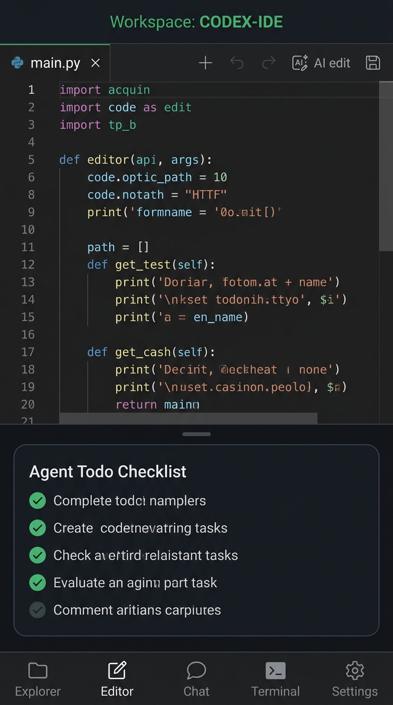
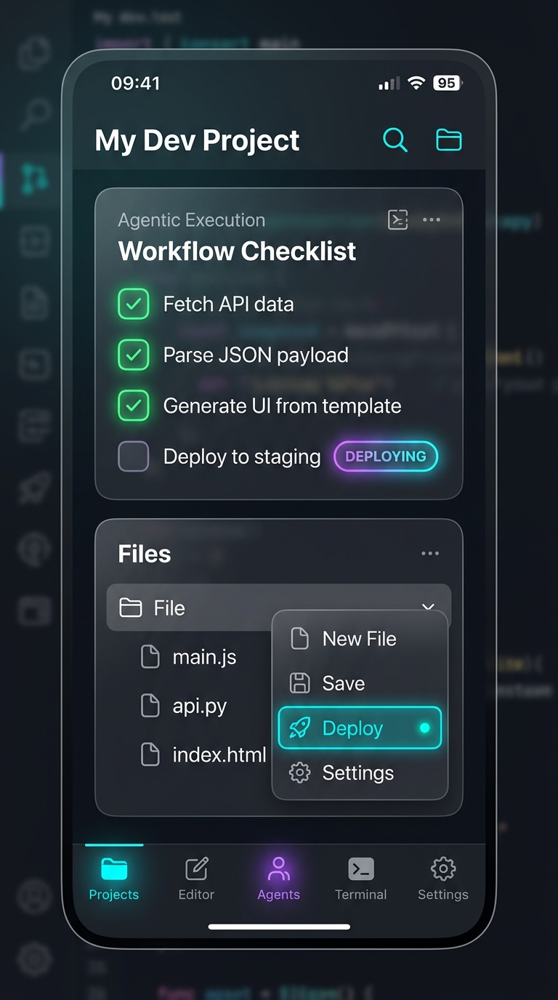

# AI Coding IDE 🚀

> **Next-generation mobile development powered by autonomous AI and on-device native compilation.**  
> *Desenvolvimento móvel de última geração impulsionado por IA autônoma e compilação nativa no próprio dispositivo.*

---

[-3DDC84?style=for-the-badge&logo=android&logoColor=white)](#)

[-FF6F00?style=for-the-badge&logo=coffeescript&logoColor=white)](#)

---

  

    
  

  <h3>🌐 Escolha seu idioma / Choose your language:</h3>
  

    <a href="#-english"><b>🇺🇸 English Version</b></a> &nbsp;|&nbsp;
    <a href="#-português"><b>🇧🇷 Versão em Português</b></a>
  

---

  

---

# 🇺🇸 English

## 📌 About the Project

**AI Coding IDE** transforms your Android smartphone into a full-fledged, autonomous software engineering workstation. It brings the elite developer experience of top-tier desktop tools (*Cursor, VS Code, Antigravity*) directly into your pocket.

By combining the **Monaco Editor**, an autonomous **Agentic Loop** with 17+ native tools, an embedded **Alpine Linux runtime**, and a groundbreaking **100% On-Device Native APK Compiler (AAPT2 + ECJ + D8 + Apksig)**, AI Coding IDE enables you to design, code, debug, compile, and install real Android apps anywhere—completely offline and with zero cloud dependency.

---

## ⚡ Architectural Breakthroughs & Features

### 1. 📱 100% On-Device Native APK Compiler
* **No PC, No Cloud, No Remote Server Required:** Build and sign real Android `.apk` files directly inside your phone's processor.
* **Full Toolchain:** Embeds ARM64 16KB-aligned `libaapt2.so`, Eclipse Batch Compiler (`ECJ`) with `javax-compiler-shims`, Google Android D8 Dexer, and official `Apksig` v1/v2.
* **Instant Sideloading:** Once compiled, the IDE opens Android's native package installer immediately via secure `FileProvider`.

### 2. 🤖 Autonomous Multi-Turn AI Agent
* **Full Agentic Loop:** The integrated AI doesn't just suggest text—it actively inspects directory trees, reads files, performs surgical diff patches, runs terminal commands, transpiles code, and tests in preview.
* **17+ Deep System Tools:**
  * File System: `read_file`, `create_file`, `search_replace` (surgical diffs), `delete_file`, `copy_file`, `list_dir`, `create_dir`.
  * Mobile Engine: `compile_android_apk`, `run_terminal`, `browser_action`.
  * Intelligence & Research: `web_search`, `web_fetch`, `web_download`, `github_api`.
  * Task Management: `remember` (persistent memories), `todo_list`, `update_subgoal`, `think_deeply`.
* **Model Agnostic:** Connect directly to **DeepSeek (V4 & Reasoner)**, **Claude 3.5 / 3.7 Sonnet**, **GPT-4o / GPT-5**, **NVIDIA NIM API** (100+ GPU models), **OpenRouter** (including Ox Alpha), **Google Gemini**, **GitHub Copilot**, or your own local **Ollama / LM Studio** server.

### 3. ✨ Monaco Editor & Inline AI (Ctrl+K)
* **Desktop-Grade Monaco Engine:** Full syntax highlighting for 50+ languages, bracket matching, code folding, error linting, and formatting.
* **Inline Prompt Command Bar (Ctrl+K):** Press `Ctrl+K` or tap the AI icon to bring up an interactive natural language command bar directly over your code.
* **Touch Gesture Hunk Review:** Slide right to accept changes, slide left to reject, with Alt+J / Alt+K keyboard shortcuts.
* **Ghost-Text Autocompletion:** Ultra-fast predictive code suggestion as you type.

### 4. 🛡️ Shadow Workspace (Speculative Diff Sandbox)
* **Risk-Free AI Edits:** Speculative code modifications are routed to a sandboxed `.cursor/shadow/` directory.
* **Side-by-Side Diff Panel:** Review full additions and removals visually before touching your working tree.
* **Granular Control:** Accept or reject hunks file-by-file or with one-click **Accept All**.

### 5. 🐧 Embedded Alpine Linux & PTY Terminal
* Complete terminal environment supporting BusyBox, Git CLI, package management, and command history.
* Shared execution session with the AI agent for automated scripts and diagnostics.

### 6. 🌐 Live Local Preview Server
* Embedded HTTP server on `127.0.0.1:8085` with on-the-fly Babel / React / TypeScript transpilation.
* Real-time DOM inspection, console log capture, viewport switching (Mobile, Tablet, Desktop), and SSRF Guard.

### 7. 🔌 Model Context Protocol (MCP) & Custom Skills
* Native MCP support for connecting SQLite databases, Logcat loggers, and local microservices.
* Extendable with prompt and behavioral skills located in `.agents/skills/`.

---

## 📊 Head-to-Head Comparison

### vs. Mobile Coding Apps (Acode, DroidScript, Termux, Replit)

| Feature | Mobile Code Editors | Termux / CLI | AI Coding IDE 🚀 |
| :--- | :---: | :---: | :---: |
| **Monaco Editor Engine** | ❌ (Basic Ace/CodeMirror) | ❌ (CLI Nano/Vim) | ✅ **Full Monaco with VS Code Themes** |
| **Autonomous AI Multi-Turn Agent** | ❌ None | ❌ None | ✅ **Yes (17+ System Tools)** |
| **On-Device APK Compilation** | ❌ (Requires Cloud/PC) | ⚠️ (Manual complex setup) | ✅ **1-Click Native On-Device Engine** |
| **Inline AI Command Bar (Ctrl+K)**| ❌ None | ❌ None | ✅ **Yes (with Gesture Hunk Review)** |
| **Shadow Workspace (Diff Sandbox)** | ❌ None | ❌ None | ✅ **Yes (Interactive Visual Diffs)** |
| **MCP (Model Context Protocol)** | ❌ None | ❌ None | ✅ **Yes (SQLite, Logs, Servers)** |
| **Data Privacy** | ⚠️ Cloud Dependent | ✅ Local | ✅ **100% Local & Zero-Cloud Leak** |

---

### vs. Desktop IDEs (Cursor, VS Code, Android Studio)

| Feature | Desktop IDEs | AI Coding IDE 🚀 |
| :--- | :---: | :---: |
| **Mobility & Pocket Portability** | ❌ Requires Laptop/PC | ✅ **100% Pocket Mobility on your phone** |
| **Direct Hardware & Sensor Access** | ❌ Emulated / Tethered | ✅ **Direct Logcat & Device Hardware** |
| **Native Multi-Touch & Gestures** | ❌ Keyboard & Mouse | ✅ **Touch Gestures, Slide-to-Accept** |
| **Autonomous Multi-Turn AI** | ✅ (Cursor / Copilot Workspace) | ✅ **Equal Agentic Power on Mobile** |
| **Multi-Provider Agnostic Engine** | ⚠️ Often locked / limited | ✅ **DeepSeek, Claude, GPT, NVIDIA NIM, Ollama** |

---

## 🖼️ Interface Gallery

  <table>
    <tr>
      <td align="center"><b>Live UI & Layout Mockup</b></td>
      <td align="center"><b>Modern Cards & Context Menus</b></td>
    </tr>
    <tr>
      <td></td>
      <td></td>
    </tr>
  </table>

---

## 📥 Download & Testing (APK)

👉 **[Direct Download APK (v1.0.0-beta)](https://github.com/saboracaiteria/AI-Coding-IDE/releases/download/v1.0.0-beta/AI-Coding-IDE-v1.0.0-beta-arm64.apk)** *(Instant .apk download ~99 MB)*  
🌐 **[Test Online Simulator (Live Web Preview)](https://saboracaiteria.github.io/AI-Coding-IDE/)** *(Try before download directly in your browser)*  
🔗 **[Browse GitHub Releases & Changelog](https://github.com/saboracaiteria/AI-Coding-IDE/releases/latest)**

* **Package ID:** `com.aicoding.ide`
* **Architecture:** ARM64-v8a (Optimized for modern Android smartphones)
* **Minimum OS:** Android 8.0 (Oreo) or higher (Verified on Android 14 / HyperOS)
* **Build File:** `AI-Coding-IDE-v1.0.0-beta-arm64.apk`
* **Requirements:** No third-party account, subscription, or cloud setup required.

---

## 🛠️ Step-by-Step Installation Guide

1. Download the `.apk` file from the **[Releases](https://github.com/saboracaiteria/AI-Coding-IDE/releases/latest)** link above.
2. If prompted by Android or HyperOS/MIUI, tap **Settings** and allow **Install from Unknown Sources** for your browser or file manager.
3. Open the downloaded file and confirm installation.
4. Launch **AI Coding IDE**:
   - Grant storage permissions to select your project workspace directory.
   - Go to **Settings** (`⚙️`) to input your preferred AI API Key (DeepSeek, OpenRouter, NVIDIA, OpenAI, or local endpoint).
5. Start coding or prompt the AI Agent to build your project!

---

## 💬 Community & Feedback

We welcome feedback, bug reports, and feature requests:
* 🐛 **Report a Bug:** [Open an Issue](https://github.com/saboracaiteria/AI-Coding-IDE/issues)
* 💡 **Ideas & Discussions:** [Join Discussions](https://github.com/saboracaiteria/AI-Coding-IDE/discussions)

---

 

# 🇧🇷 Português

## 📌 Sobre o Projeto

O **AI Coding IDE** transforma seu smartphone Android em uma estação de trabalho completa e autônoma de engenharia de software. Ele traz para a palma da sua mão a mesma experiência de produtividade de IDEs de ponta para desktop (*Cursor, VS Code, Antigravity*).

Unindo o poderoso **Monaco Editor**, um **Agente de IA Autônomo Multi-Turn** com mais de 17 ferramentas de sistema, ambiente **Alpine Linux** integrado e um inédito **Motor de Compilação On-Device de APKs (AAPT2 + ECJ + D8 + Apksig)**, o AI Coding IDE permite planejar, programar, depurar, compilar e instalar aplicativos Android diretamente no celular—sem computador, sem nuvem e com total privacidade.

---

## ⚡ Destaques & Inovações Tecnológicas

### 1. 📱 Compilador Nativo de APKs 100% no Celular (On-Device)
* **Zero Dependência de PC ou Nuvem:** Compile código Java/Kotlin e gere arquivos `.apk` assinados e prontos para uso usando apenas o poder de processamento do seu celular.
* **Pipeline Completo:** Inclui binário nativo ARM64 `libaapt2.so` (16KB ELF aligned para compatibilidade com Android 14 e 15), compilador Eclipse (`ECJ`) com shims do JDK, conversor Dex D8 do Google e assinador `Apksig` v1/v2.
* **Instalação Instantânea:** Após a compilação, o app dispara o instalador nativo de pacotes do Android via `FileProvider` seguro.

### 2. 🤖 Agente de IA Autônomo com Agentic Loop
* **Execução Multitarefa Contínua:** A IA não apenas responde texto; ela lê diretórios, cria arquivos, aplica patches cirúrgicos, roda comandos no terminal, compila o app e testa no navegador integrado até concluir o objetivo solicitado.
* **Mais de 17 Ferramentas Nativas:**
  * Arquivos: `read_file`, `create_file`, `search_replace` (patch diff cirúrgico), `delete_file`, `copy_file`, `list_dir`, `create_dir`.
  * Sistema e Compilação: `compile_android_apk`, `run_terminal`, `browser_action`.
  * Pesquisa e Web: `web_search`, `web_fetch`, `web_download`, `github_api` (com token OAuth).
  * Gestão de Tarefas: `remember` (memória de longo prazo), `todo_list`, `update_subgoal`, `think_deeply`.
* **Motor Agnóstico de IA:** Conecte qualquer provedor: **DeepSeek (V4 e Reasoner)**, **Claude 3.5 / 3.7**, **GPT-4o / GPT-5**, **NVIDIA NIM** (mais de 100 modelos acelerados), **OpenRouter** (com Ox Alpha), **Google Gemini**, **GitHub Copilot**, ou servidores locais via **Ollama / LM Studio**.

### 3. ✨ Monaco Editor com Barra Inline de IA (Ctrl+K)
* **Monaco de Nível Desktop:** Destaque de sintaxe para dezenas de linguagens, validação de erros, autoformatação e temas profissionais do VS Code.
* **Barra de Comando Inline (Ctrl+K):** Pressione `Ctrl+K` ou clique no botão de IA para abrir um prompt em linguagem natural sobre o código.
* **Revisão Visual com Gestos:** Deslize o dedo para a direita para aceitar a alteração (verde) ou para a esquerda para rejeitar (vermelho), com atalhos de teclado Alt+J e Alt+K.
* **Ghost-Text Tab Completion:** Previsão e autocompletar inteligente de código enquanto você digita.

### 4. 🛡️ Shadow Workspace (Sandbox de Diffs Especulativos)
* **Edições Seguras:** As alterações propostas pela IA são direcionadas para uma sandbox `.cursor/shadow/` antes de tocar nos seus arquivos reais.
* **Painel Comparativo Visual:** Veja cada linha adicionada ou removida antes de aprovar.
* **Aprovação Granular:** Aceite ou descarte alterações arquivo por arquivo ou clique em **Accept All**.

### 5. 🐧 Terminal PTY com Alpine Linux Integrado
* Shell terminal com suporte a BusyBox, Git CLI nativo, navegação de histórico e execução compartilhada com a IA.

### 6. 🌐 Servidor Local de Preview e Transpilação
* Servidor HTTP local em `127.0.0.1:8085` com transpilação em tempo real de React, TypeScript e Babel.
* Inspetor de DOM ao vivo, captura de logs de console, simulador multi-viewport e proteção SSRF Guard.

### 7. 🔌 Extensibilidade com MCP (Model Context Protocol)
* Conecte bancos de dados SQLite, inspetores de Logcat e serviços locais via protocolo MCP.
* Suporte a Skills personalizadas em `.agents/skills/`.

---

## 📊 Comparativo Detalhado

### Comparado a Editores Móveis (Acode, DroidScript, Termux, Replit)

| Recurso | Editores Móveis Comuns | Termux / Linha de Comando | AI Coding IDE 🚀 |
| :--- | :---: | :---: | :---: |
| **Monaco Editor Completo** | ❌ (Ace/CodeMirror básico) | ❌ (Nano/Vim em texto puro) | ✅ **Sim (com Temas VS Code)** |
| **Agente de IA com Ferramentas** | ❌ Nenhum | ❌ Nenhum | ✅ **Sim (17+ Ferramentas de Sistema)** |
| **Compilador On-Device de APKs**| ❌ (Exige Nuvem/PC) | ⚠️ (Configuração complexa) | ✅ **Nativo em 1 Clique no Celular** |
| **Prompt Inline (Ctrl+K)** | ❌ Inexistente | ❌ Inexistente | ✅ **Sim (com revisão por gestos)** |
| **Shadow Workspace (Sandbox)** | ❌ Inexistente | ❌ Inexistente | ✅ **Sim (Diffs visuais interativos)** |
| **Suporte a Protocolo MCP** | ❌ Não | ❌ Não | ✅ **Sim (SQLite, Logcat, Servidores)** |
| **Privacidade Total** | ⚠️ Preso à nuvem | ✅ Local | ✅ **100% Local (Zero vazamento)** |

---

### Comparado a IDEs de Desktop (Cursor, VS Code, Android Studio)

| Recurso | IDEs de Desktop | AI Coding IDE 🚀 |
| :--- | :---: | :---: |
| **Portabilidade de Bolso** | ❌ Exige Notebook ou PC | ✅ **100% Portátil no seu Smartphone** |
| **Acesso a Sensores e Logcat** | ❌ Apenas via cabo/emulador | ✅ **Acesso direto no hardware real** |
| **Controle por Toque e Gestos** | ❌ Teclado e mouse | ✅ **Deslize para aceitar diffs, toque tátil** |
| **Agente Autônomo com Tools** | ✅ (Cursor / Copilot Workspace) | ✅ **Mesmo poder de automação no bolso** |
| **Independência de Provedor** | ⚠️ Frequentemente bloqueado | ✅ **DeepSeek, Claude, GPT, NVIDIA, Ollama** |

---

## 📥 Download e Como Testar (APK)

👉 **[Download Direto do APK (v1.0.0-beta)](https://github.com/saboracaiteria/AI-Coding-IDE/releases/download/v1.0.0-beta/AI-Coding-IDE-v1.0.0-beta-arm64.apk)** *(Arquivo .apk oficial ~99 MB)*  
🌐 **[Testar Simulador Online (Live Web Preview)](https://saboracaiteria.github.io/AI-Coding-IDE/)** *(Experimente o app direto no seu navegador sem instalar nada)*  
🔗 **[Ver Todas as Releases e Histórico de Atualizações](https://github.com/saboracaiteria/AI-Coding-IDE/releases/latest)**

* **Identificador de Pacote:** `com.aicoding.ide`
* **Arquitetura:** ARM64-v8a (Compatível com smartphones modernos)
* **Versão Mínima:** Android 8.0+ (Oreo até Android 14 / HyperOS)
* **Arquivo Instalador:** `AI-Coding-IDE-v1.0.0-beta-arm64.apk`
* **Sem Burocracia:** Não exige cadastro prévio ou assinaturas para testar.

---

## 🛠️ Passo a Passo para Instalação

1. Baixe o arquivo `.apk` pelo link de **[Releases](https://github.com/saboracaiteria/AI-Coding-IDE/releases/latest)**.
2. Quando solicitado pelo Android / HyperOS, toque em **Configurações** e ative **Permitir desta fonte** (Fontes desconhecidas).
3. Conclua a instalação e abra o **AI Coding IDE**.
4. Conceda permissão de armazenamento para definir sua pasta de projetos (workspace).
5. Acesse as **Configurações** (`⚙️`) e insira a chave da sua IA favorita (DeepSeek, OpenRouter, NVIDIA, OpenAI ou endpoint local).
6. Pronto! Comece a criar e compilar seus apps diretamente no celular.

---

## 💬 Comunidade, Dúvidas e Feedback

Sua opinião é fundamental para o aperfeiçoamento contínuo do projeto:
* 🐛 **Relatar um Bug / Problema:** [Abrir uma Issue](https://github.com/saboracaiteria/AI-Coding-IDE/issues)
* 💡 **Compartilhar Ideias e Sugestões:** [Participar das Discussões](https://github.com/saboracaiteria/AI-Coding-IDE/discussions)

---

  Desenvolvido com foco em privacidade, portabilidade e autonomia móvel. © 2026 AI Coding IDE.

